### **1. Config/Setup/Login**

After downloaded the project, you NEED TO open Resiliency.xcworkspace file

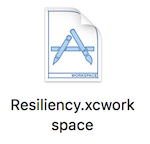

Then you can build this app either on a simulator or on a iphone device.

If you want to test the push notificaiton feature, you NEED TO build this app on a real iphone device, and allow notification.

We have several users registered already,

of which the coaches are: coach1, coach2, 

the medical practitioners (non-coach) are: amy, tony, mary, david, mark, shane.

The password for all the users is: 123

### **2. Videos**

If you prefer to learn to use this app according to several videos, you can go to google drive to see the video about the features of the app.

https://drive.google.com/open?id=1m6C4ppBo91DrA_4pZwqKWNNk4KWu8yFm 

If you want to test the PUSH NOTIFICATION feature, you NEED TO go through the following instructions

### **Now we will go through a usecase related to PUSH NOTIFICATION feature**

**You need to use a simulator/iphone to build and login as a coach, and you MUST use an iphone device to build and login as a medical practitioner,**

**because only iphone can receive push notification, while simulators cannot**

### **3. Login**

On coach side(simulator/iphone), login with username "coach1", and password "123"

<kbd>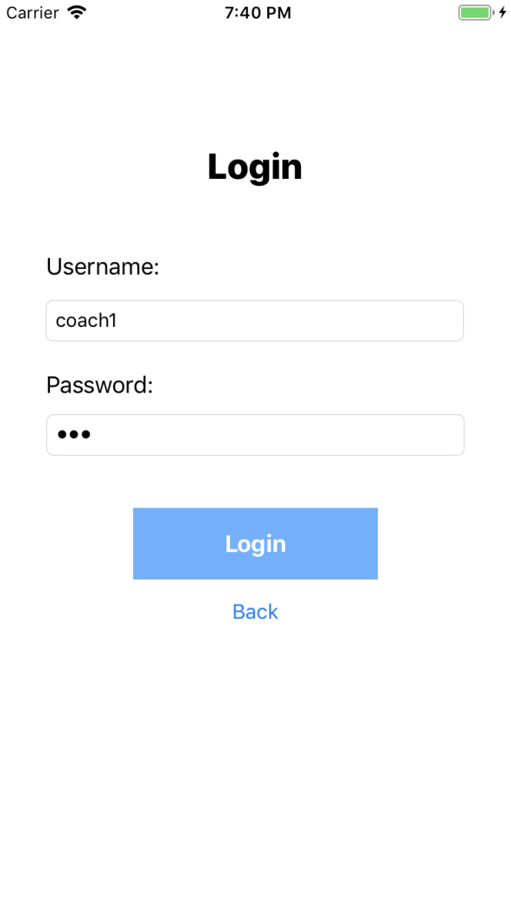</kbd>

On medical practitioner side(MUST BE iphone), login with username "david", and password "123"

### **4. When the coach removes a person from a group, the person will receive a notification on his/her iphone.**

**On coach side**, in the leftmost "Tasks" tab, there is a Group list, which lists the groups that are led by this coach.

For example, enter group "duke", there are 2 tabs, "Tasks" and "Members", where "Tasks" lists the tasks assigned in this group, "Members" lists the members in this group.

Now you can swipe left on the cell "david" to remove david from group "duke".

<kbd>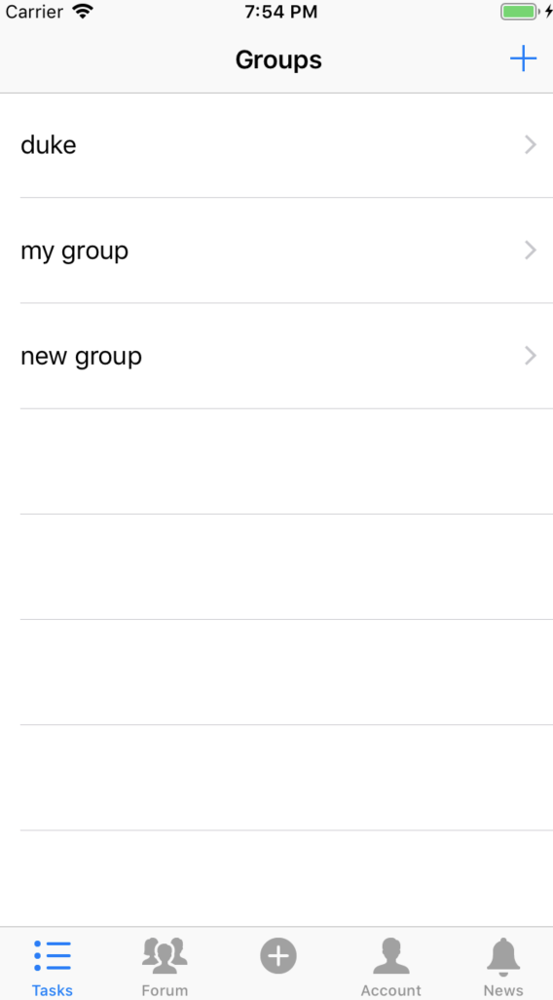</kbd>  <kbd>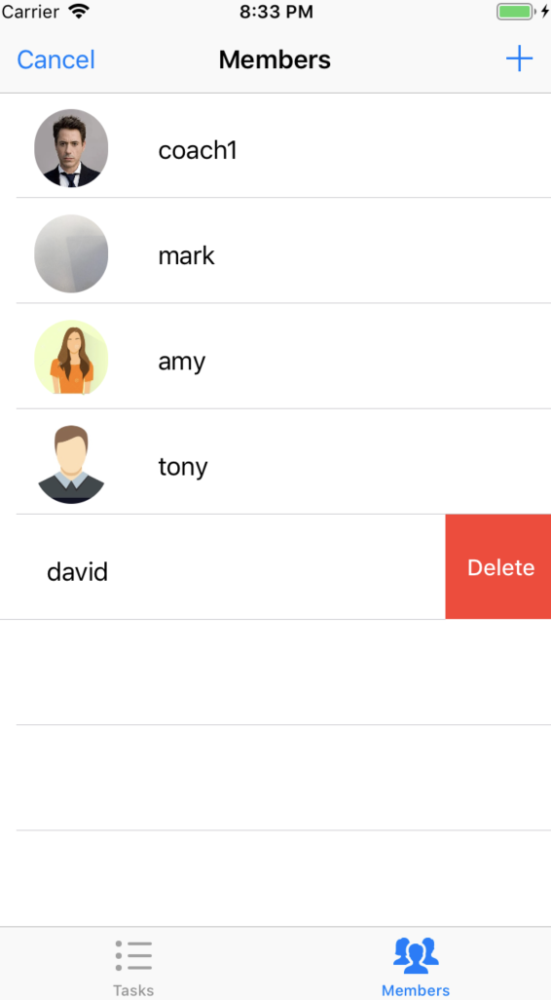</kbd>   

**On david's side (iphone)**, if the app is running on the background, you will receive a push notificaiton stated that "You are removed from group "duke" by your coach."

Click the notification, you can see the notification shown on the "News" tab.

<kbd></kbd> <kbd>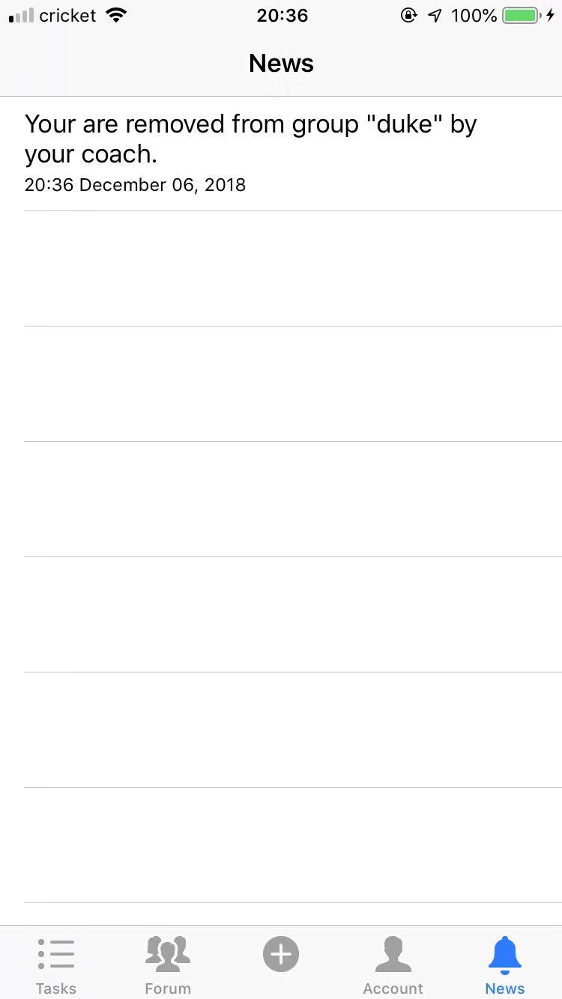</kbd>

### **5. When the coach adds a person to a group, the person will receive a notification on his/her iphone.**

**On coach side**, still at where you were in the last step("Members" tab), click "+" in the upperright corner to add a person to group "duke".

Click the "ADD" button on the right side of david, to add david back to group "duke".

<kbd>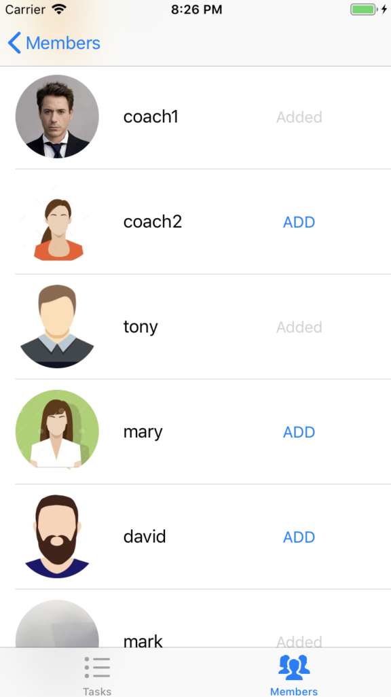</kbd>

**On david's side (iphone)**, if the app is running on the background, you will receive a push notificaiton stated that "You are invited to group "duke"."

Click the notification, you can see the notification shown on the "News" tab.

<kbd>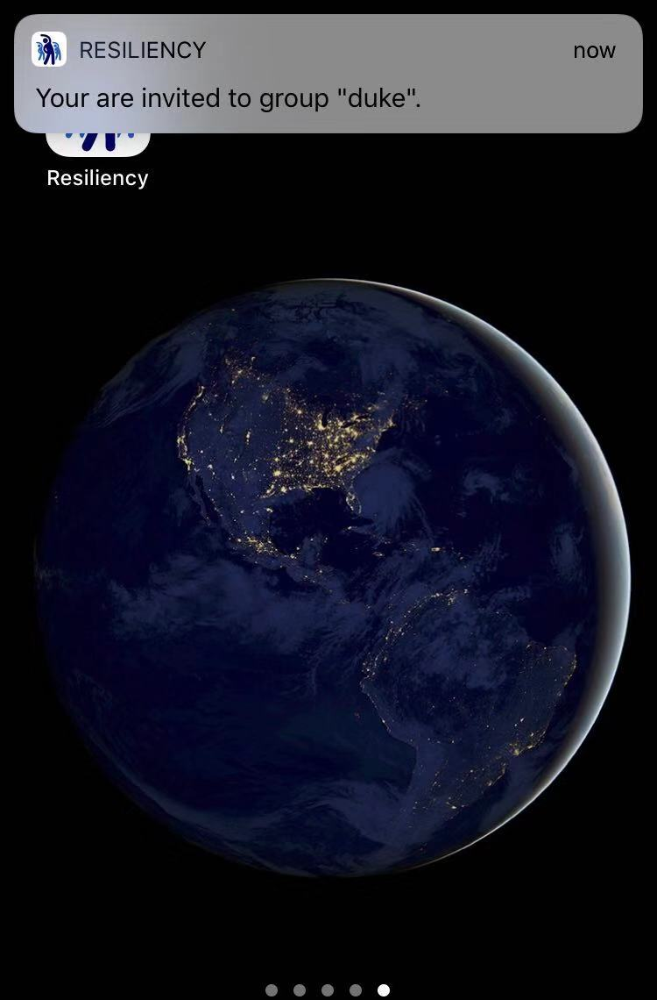</kbd> <kbd>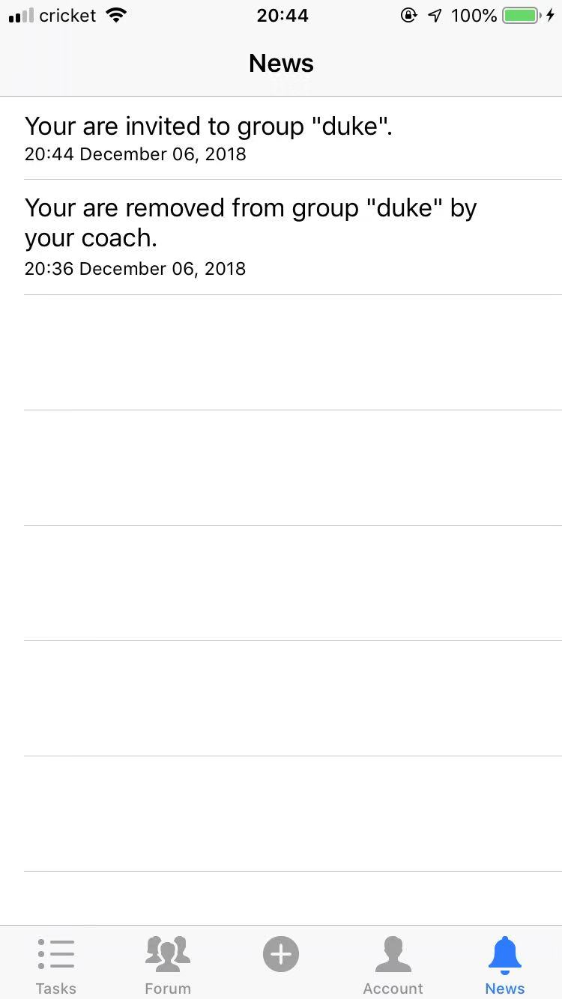</kbd>

### **6. When the coach assigns a new task to a group, members in that group will receive a notification on his/her iphone.**

**On coach side**, still at where you were in the last step, click "Tasks" tab, you can see the current tasks in group "duke".

Now click "+" in upperright corner to assign a new task, input the type and the content of this task, and click "Submit".

<kbd>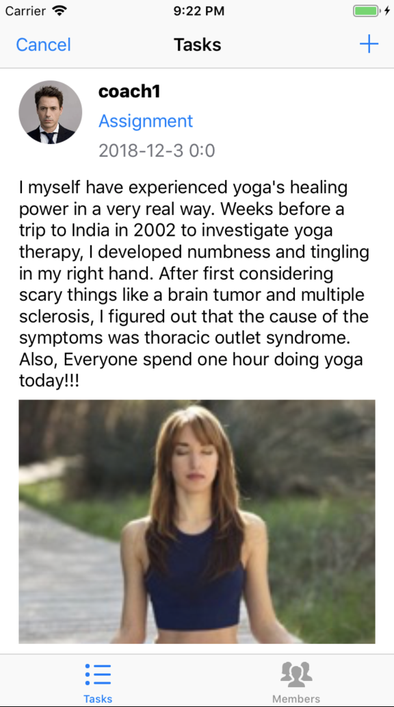</kbd>  <kbd>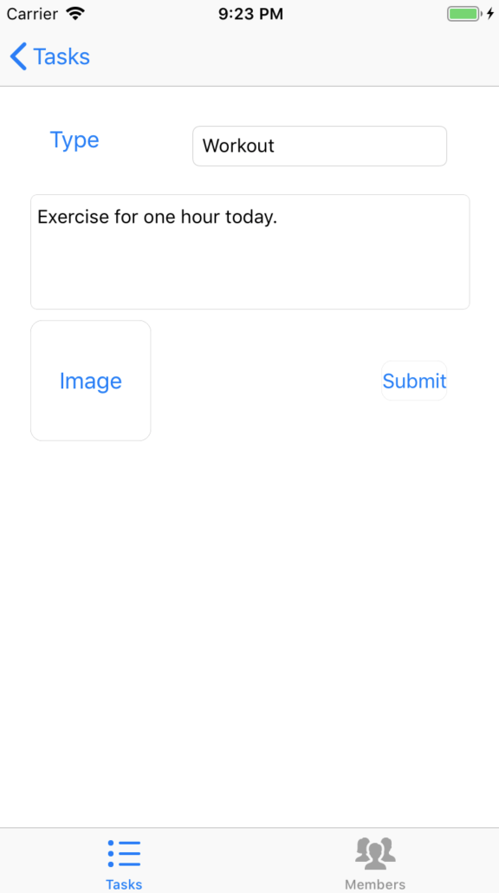</kbd>

**On david's side (iphone)**, if the app is running on the background, you will receive a push notificaiton stated that "A new task posted in group "duke", check it out."

Click the notification, you can see the notification shown on the "News" tab. You can also see the new task posted on "Tasks" tab

<kbd>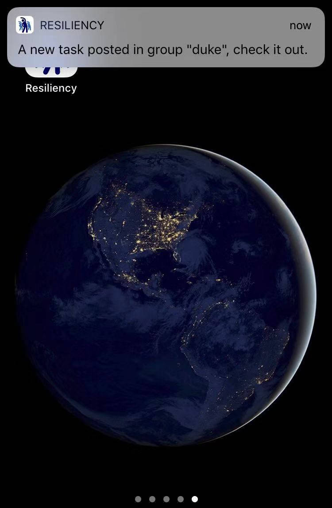</kbd> <kbd>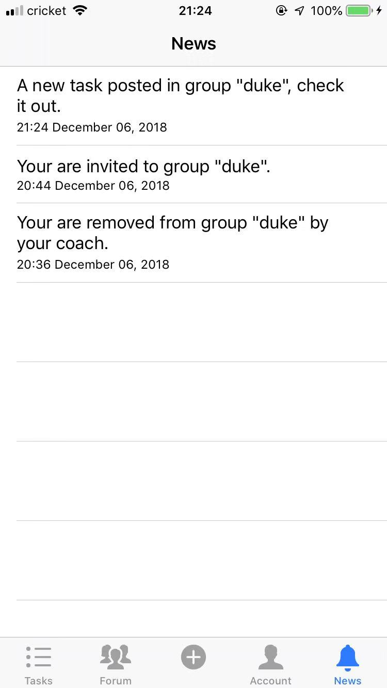</kbd> <kbd>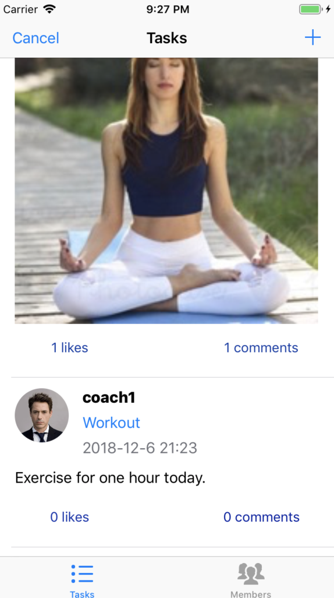</kbd>

### **Now I will briefly show you the "Forum" tab, "Check-in" tab, and "Account",**

**all of which you can see details from the Videos**

### **7. Forum tab** 

This tab is for both coaches and medical practitioners to share thoughts. 

You cannot like a post twice. If you tap the like button and there is no response, this means you have already liked the post. This logic is the same for the task in the group tab.

<kbd>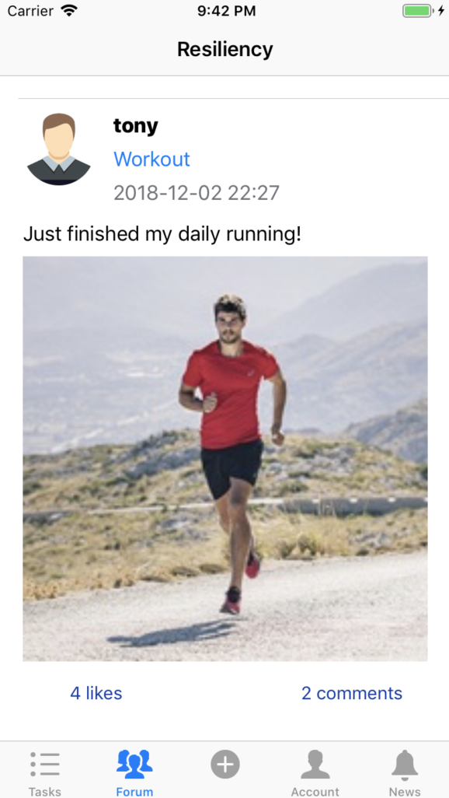</kbd>  <kbd>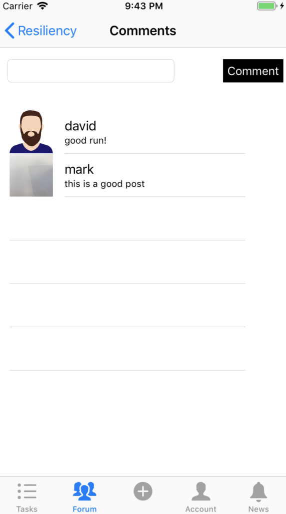</kbd>

### **8. Check-in tab** 

After "Checking-in" a type of activity, a post will be posted to the public forum.

<kbd>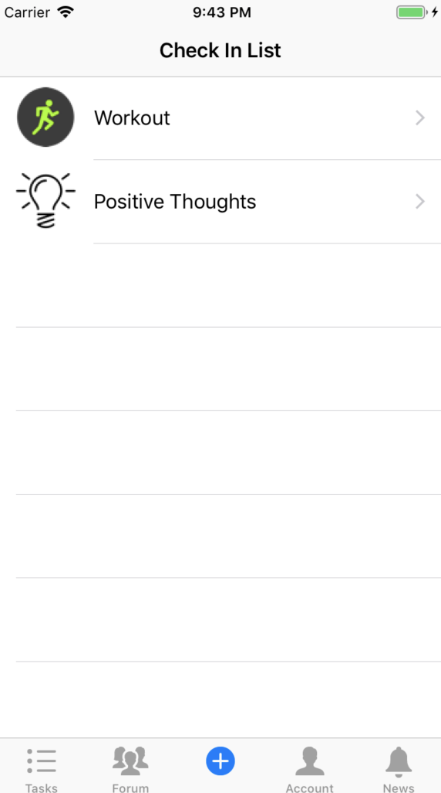</kbd>  <kbd>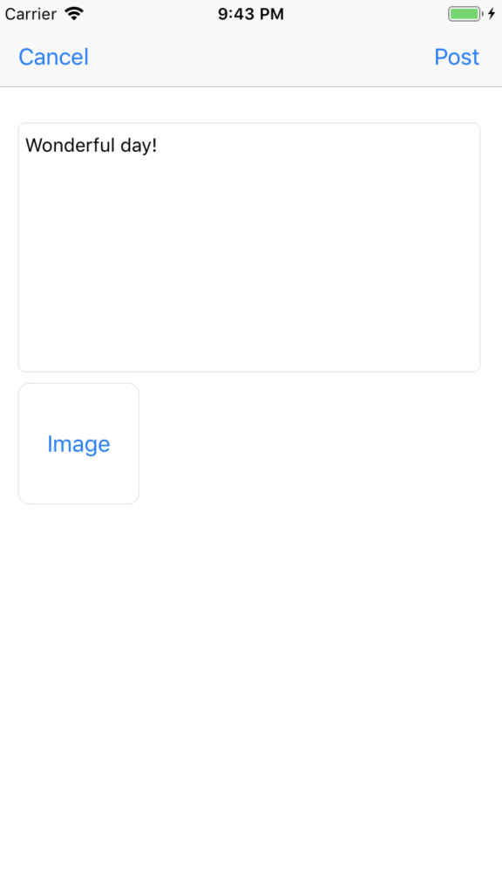</kbd>

### **9. Account tab** 

In this page, you can set the age and gender of the user and log out the app, after which you can switch the user.

<kbd>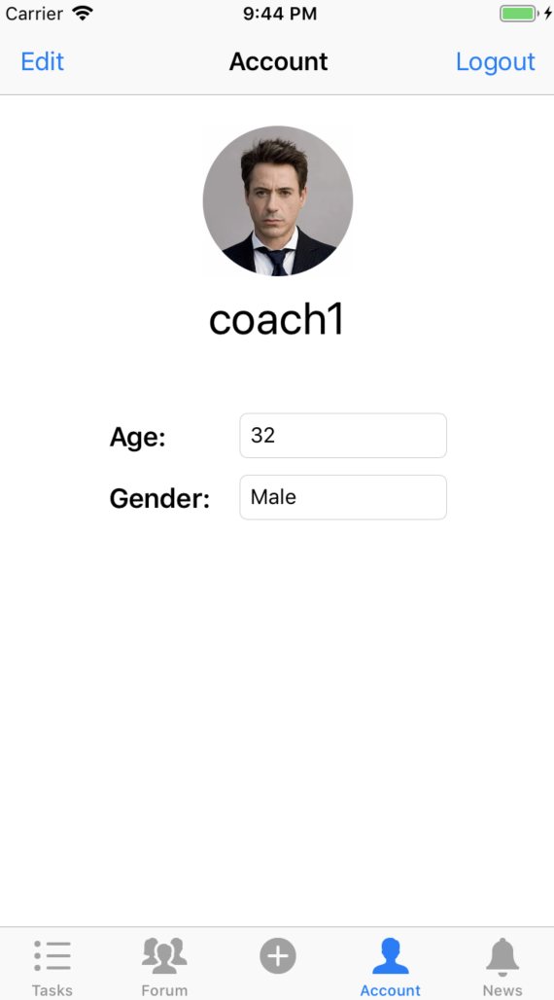</kbd>
